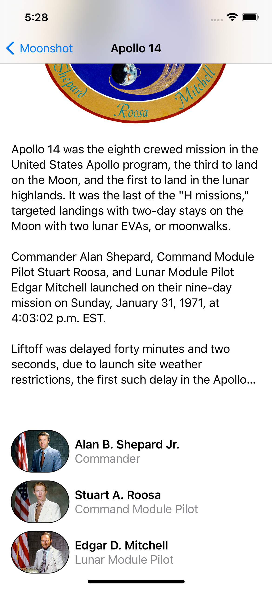
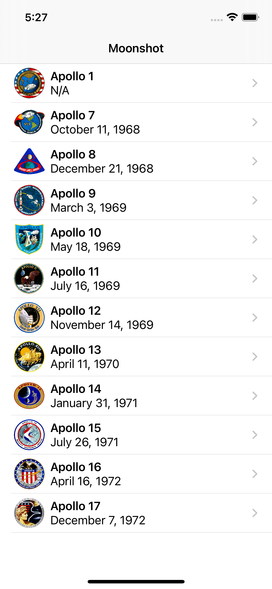

# Moonshot 🌙 🧑‍🚀

An App to discover SwiftUI, lot of codable and Generics. Simple but useful.

## Technical approach
* Codable
* SwiftUI Navigation
* Generic

From the Hacking with Swift Book by [Paul Hudson](https://github.com/twostraws)   
🤌 Go buy his books and other stuff he make, very high quality.

---
> For more good stuff star me on Github or follow me on [Async Tech Blog](https://blog.async-agency.com)

